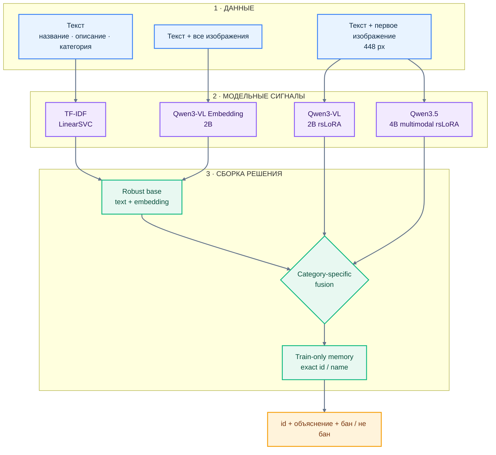

# Решение 140: от `0.479` до `0.892`

Не одна большая модель. **Три мультимодальных Qwen-сигнала, сильный text
baseline, category-specific fusion и точная train-only память.**

> **Public Macro F1 — `0.8923976821`** · immutable submission SHA
> `6cc2fda9d17d959880050889d964c3b971b92adbfa606505df7f04b46a819cd3`

## Данные подсказали решение

У БАД подтверждены 74.5% карточек, у легковоспламеняющихся — только 3.6%.
Поэтому категории требуют разных fusion weights, а редкий flammable-класс —
отдельного multimodal reasoning.

## Архитектура

- **Qwen3-VL-Embedding** видит все доступные изображения.
- **Обе LoRA-ветки** видят одно и то же первое изображение 448 px.
- TF-IDF и embedding образуют robust base; Qwen3-VL и Qwen3.5 добавляются с
  разными весами по категории; product memory применяется последней.

## Шесть поворотов, которые дали финал

| Шаг | Что узнали | Решение |
|---|---|---|
| **000 · TF-IDF** | Сильный текст поднял Public до `0.7130` | Оставили быстрым anchor |
| **030 → 040 · vision + fusion** | Image signal слаб один, но дополняет текст: `0.7220 → 0.8066` | Зафиксировали late fusion |
| **090 · complex ensemble** | Больше heads дали хуже: Public `0.7855` | Выбросили переобученную сложность |
| **110 · Qwen3-VL rsLoRA** | Supervised vision сильнее frozen embedding | Добавили первую LoRA-ветку |
| **130 → 140 · Qwen3.5 + memory** | Независимый multimodal reasoning и точные доноры дополнили систему | Собрали решение 140 |
| **После 140** | Fuzzy priors, второй seed и широкий routing не улучшили Public | Не усложняли победивший рецепт |

Итоговый скачок дал не размер модели, а правильное разделение ролей:
**текст отвечает за устойчивость, изображения — за свидетельство, Qwen3.5 — за
контекст, fusion — за разный class balance, память — только за точные повторы.**

Точные команды, веса fusion и provenance: [`final/`](../../experiments/140_dual_lora_fusion/final/).
Полная история отправок: [`reports/submissions.csv`](../../reports/submissions.csv).
