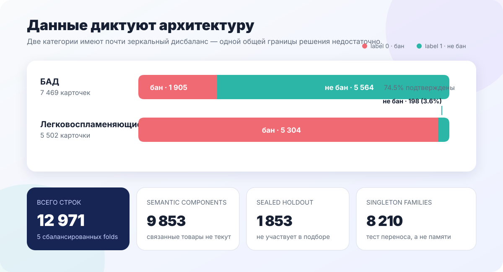
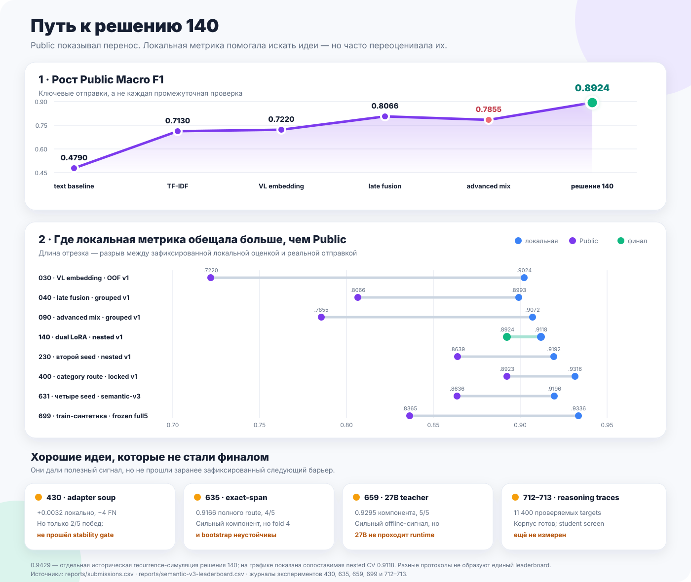
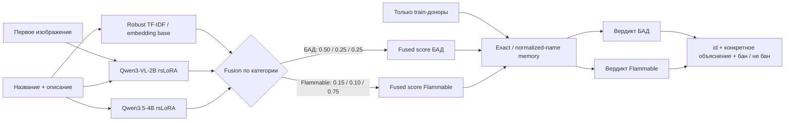
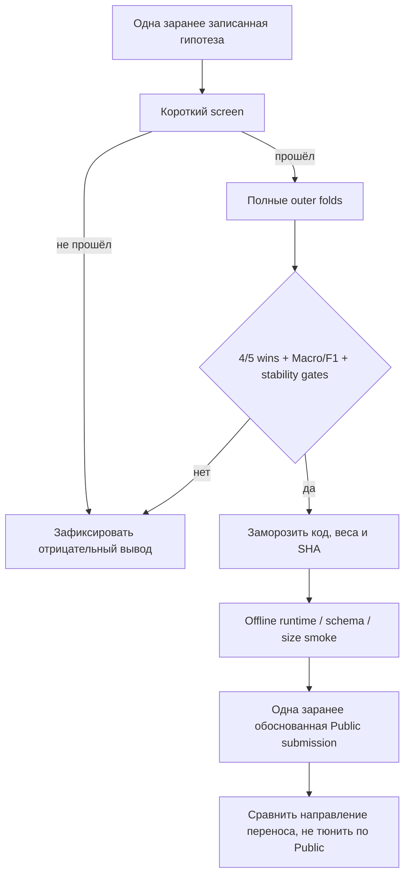

# Как мы пришли к решению 140

Это короткий маршрут по исследованию для жюри. Он показывает не все запуски, а
только решения, которые изменили архитектуру или остановили убедительную, но
непереносимую ветку. Все числа связаны с machine-readable результатами в
[`reports/`](../../reports/), а финальный технический handoff находится в
[`experiments/140_dual_lora_fusion/final/`](../../experiments/140_dual_lora_fusion/final/).

## За минуту

**Решение 140** объединяет четыре разных источника сигнала:

1. устойчивый word/char TF-IDF и multimodal embedding base;
2. Qwen3-VL-2B rsLoRA для визуального и текстового свидетельства;
3. Qwen3.5-4B rsLoRA для category-specific reasoning;
4. train-only exact/name product memory для повторяющихся карточек.

Финальный неизменяемый архив получил **Public Macro F1 `0.8923976821`**. Главный
вывод исследования: качество пришло не от одной большой модели и не от
максимально сложного ensemble, а от объединения **независимых ошибок** с разными
весами для двух категорий.

Данные почти зеркальны по классам: среди БАД категория подтверждается у 74.5%
карточек, а среди легковоспламеняющихся — только у 3.6%. Поэтому единая модель,
единый threshold и одинаковая fusion-логика систематически проигрывали
category-specific решению. Статистика рассчитана непосредственно из
[`validation/grouped_text_v1/folds.csv`](../../validation/grouped_text_v1/folds.csv)
и [`validation/semantic_family_v3/folds.csv`](../../validation/semantic_family_v3/folds.csv).

## Эволюция решения

| Этап | Проверяемая гипотеза | Результат | Решение |
|---|---|---|---|
| 000 · text baseline | Название и описание уже дают сильный сигнал | Public вырос с `0.4790` до `0.7130` после robust word/char TF-IDF | Оставить как дешёвый и устойчивый anchor |
| 030 · VL embedding | Изображение даёт независимую информацию | Public `0.7220`; лучше text-only, но сильно ниже локального OOF | Не доверять одной multimodal-ветке |
| 040 · late fusion | Ошибки текста и изображения дополняют друг друга | Public `0.806579`; первый большой переносимый скачок | Зафиксировать fusion как основу |
| 090 · advanced mixed ensemble | Interaction и tree-heads выучат сложные зависимости | Public `0.785500`, то есть `−0.0211` к простому late fusion | Отказаться: сложность усилила train-like duplicates |
| 110 · Qwen3-VL rsLoRA | Supervised adaptation полезнее frozen embeddings | Nested grouped Macro `0.906395` | Добавить обучаемую visual/text ветку |
| 130–140 · Qwen3.5 + dual LoRA | Текстовый reasoning дополняет Qwen3-VL | Nested fusion Macro `0.911843` | Использовать отдельные веса по категориям |
| 140 · product memory | Точные train-only доноры полезны на повторяющихся товарах | Recurrence simulation `0.942878`; Public `0.892398` | Финальный неизменяемый архив |
| 180/190 · более широкие priors | Fuzzy/numeric/shingle близость улучшит память | Public tie или небольшое падение относительно 140 | Не усложнять финальную память |
| 230 · второй seed | Усреднение Qwen3.5 снизит variance | Локально `4/5` fold wins, Public `0.863946` | Отвергнуть: локальный gain не перенёсся |
| 400 · category route | Специалист только для редкой категории даст точечный gain | Public `0.892290`, направление перенеслось, масштаб — нет | Сохранить научный вывод, решение 140 не заменять |

Полная история отправок с SHA каждого архива находится в
[`reports/submissions.csv`](../../reports/submissions.csv). Отрицательные
результаты оставлены в таблице намеренно: они объясняют, почему финальная
архитектура компактнее многих промежуточных вариантов.

## Архитектура

Вес Qwen3.5 значительно выше на flammable-маршруте: именно там редкий
положительный класс требует контекстного различения «продаётся горючий товар» и
«горючее вещество только упомянуто в описании». Память применяется после
train-only проверки и не является lookup по тестовым меткам.

## Как мы защищались от красивой, но ложной локальной метрики

Историческое решение 140 построено на `grouped_text_v1`, поэтому его
`0.911843` нельзя смешивать с более поздним semantic-family leaderboard. Для
новых архитектурных выводов используется строгий
[`semantic_family_v3`](../../validation/semantic_family_v3/): 9 853 связанных
семейств не пересекают development folds, а 1 853 строки sealed holdout не
участвуют в обычном подборе.

## Почему результату можно доверять

- финальный архив решения 140 и основные проверяемые отправки связаны с именем и SHA-256 в
  [`reports/submissions.csv`](../../reports/submissions.csv);
- две несовместимые CV-метрики объяснены раздельно, без выбора более красивого
  числа задним числом;
- финальные fusion weights выбираются внутри donor folds и применяются к
  невиданному outer fold;
- runtime не скачивает модели или данные из интернета;
- полный repository contract проверяется командой
  `python3 experiments/140_dual_lora_fusion/final/verify.py`;
- тесты защищают официальный CLI, schema, frozen folds, leakage guards и
  воспроизводимость ключевых entrypoints.

## Что ещё не выдаётся за завершённое

Классификационная часть решения 140 зафиксирована. До финальной публикации ещё
нужно опубликовать веса с SHA, повторить runtime/size smoke на точном архиве и
закрыть независимый human gate качества объяснений. Эти пункты явно отмечены в
[`repository-readiness.md`](../hackathon/repository-readiness.md), а не скрыты за
исторической локальной метрикой.
