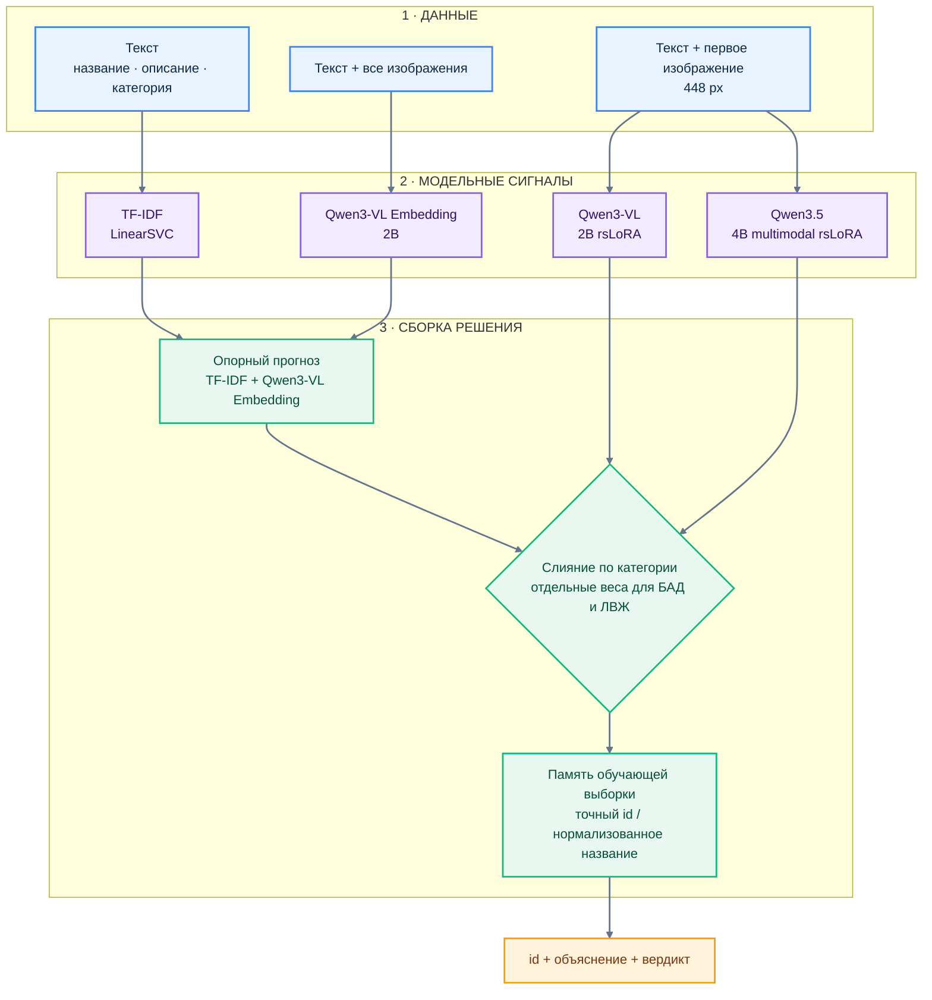

# Решение 140: от `0.479` до `0.892`

Не одна большая модель. **Три сигнала от Qwen, сильная текстовая опора,
отдельные веса для каждой категории и память только по обучающей выборке.**

> **Public Macro F1 — `0.8923976821`** · SHA неизменяемого архива
> `6cc2fda9d17d959880050889d964c3b971b92adbfa606505df7f04b46a819cd3`

## Данные подсказали решение

У БАД подтверждены 74.5% карточек, у легковоспламеняющихся — только 3.6%.
Поэтому для категорий нужны разные веса моделей. Редкий положительный класс
легковоспламеняющихся товаров сильнее зависит от изображения и контекста.

## Архитектура

- **Опорный прогноз** объединяет TF-IDF по тексту и Qwen3-VL Embedding по
  тексту и всем доступным изображениям.
- **Слияние по категории** отдельно задаёт веса опорного прогноза, Qwen3-VL и
  Qwen3.5 для БАД и легковоспламеняющихся товаров.
- **Память обучающей выборки** применяется после слияния и исправляет только
  точные совпадения по `id` или нормализованному названию. Метки проверочной и
  тестовой выборок в неё не попадают.
- Обе LoRA-ветки получают один и тот же первый снимок с длинной стороной 448 px.

## Шесть поворотов, которые дали финал

| Шаг | Что узнали | Решение |
|---|---|---|
| **000 · TF-IDF** | Сильная текстовая модель подняла Public до `0.7130` | Оставили её быстрой опорой |
| **030 → 040 · изображения и слияние** | Изображения слабы сами по себе, но дополняют текст: `0.7220 → 0.8066` | Зафиксировали позднее слияние прогнозов |
| **090 · сложный ансамбль** | Дополнительные модели ухудшили Public до `0.7855` | Убрали переобученную сложность |
| **110 · Qwen3-VL rsLoRA** | Обученная мультимодальная модель сильнее замороженных эмбеддингов | Добавили первую LoRA-ветку |
| **130 → 140 · Qwen3.5 и память** | Независимая мультимодальная модель и точные совпадения дополнили систему | Собрали решение 140 |
| **После 140** | Нечёткие правила, второй seed и широкий роутинг не улучшили Public | Сохранили более простой рецепт |

Итоговый скачок дал не размер модели, а правильное разделение ролей:
**текст отвечает за устойчивость, изображения подтверждают свойства товара,
Qwen3.5 учитывает контекст, слияние компенсирует разный баланс классов, а память
работает только на точных повторах.**

## Что ещё проверили

Путь не закончился на архитектуре 140. Мы отдельно проверили три направления,
которые выглядели перспективно, но не стали частью финального решения.

| Направление | Что сделали | Честный итог |
|---|---|---|
| **Синтетика для обучения** | Сгенерировали и отфильтровали редкие положительные примеры для класса «Легковоспламеняющиеся», затем обучили Qwen3.5-4B с небольшими дозами синтетики | Кандидат выиграл локально на 5/5 фолдах, но получил лишь `0.8365` на Public. В решение 140 синтетика не вошла — [эксперимент 699](../../experiments/699_filtered_flammable_synthesis/) |
| **Дистилляция 27B → 4B** | Передавали в компактную Qwen3.5-4B мягкие логиты сильного 27B-учителя и сравнивали с тем же обучением на жёстких метках | Дистилляция проиграла контрольной модели на двух проверочных фолдах и была остановлена — [эксперимент 681](../../experiments/681_qwen35_4b_flammable_logit_distillation/) |
| **Синтетические обоснования** | Большая модель сгенерировала структурированные `reason + evidence + explanation` для всех 12 971 карточки; строгий фильтр принял 11 400 примеров, доступных ученику по тексту и первому изображению | Корпус и обучение `rationale → label` подготовлены, но метрика ученика ещё не измерена. Это исследовательская ветка, а не заявленный результат 140 — [эксперименты 712](../../experiments/712_qwen35_397b_evidence_teacher/) и [713](../../experiments/713_qwen35_4b_rationale_then_label/) |

Здесь под reasoning traces понимаются короткие проверяемые обоснования со
ссылкой на конкретный фрагмент входа, а не скрытая цепочка рассуждений модели.

Точные команды, веса слияния и происхождение артефактов: [`final/`](../../experiments/140_dual_lora_fusion/final/).
Полная история отправок: [`reports/submissions.csv`](../../reports/submissions.csv).
